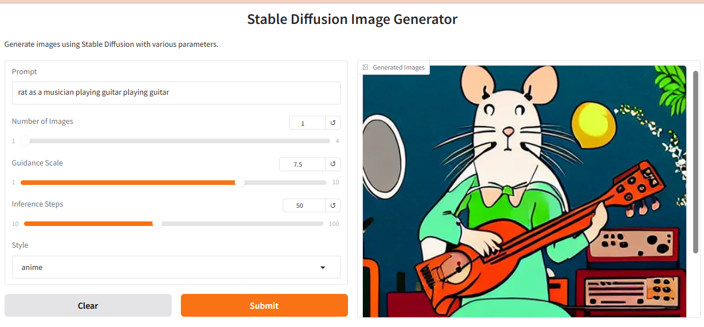

# Stable Diffusion Text‑to‑Image Generator

A clean and efficient **Gradio-based AI image generation application** that uses **Stable Diffusion v1.4** to convert natural language prompts into high‑quality images. The project demonstrates core concepts of modern generative AI, including diffusion models, latent representations, guidance scaling, and style‑based prompt enhancement.

---

## Overview

This project provides an interactive UI built with **Gradio**, allowing users to:

* Enter text prompts
* Adjust **Guidance Scale** (prompt adherence)
* Modify **Inference Steps** (image refinement)
* Select artistic **Styles** (anime, watercolor, photo, video‑game, etc.)
* Generate multiple images simultaneously

The backend loads the pre‑trained **Stable Diffusion v1.4** model from Hugging Face’s Diffusers library and uses GPU acceleration when available.

---

##  Demo image

Below is a screenshot of the interface showcasing all available controls:



---

##  Key Features

###  Style Customization

Choose from predefined artistic styles:

* **Anime** – Cute, vibrant, Ghibli inspired visuals
* **Photo** – Photorealistic, DSLR like imagery
* **Video Game** – Unreal Engine style render with dramatic lighting
* **Watercolor** – Soft, pastel, painterly textures
* **None** – Pure prompt driven output

###  Guidance Scale

Controls how strongly the model follows your prompt.

* Low → Creative & flexible
* High → Accurate & prompt‑strict

### **Inference Steps**

Higher steps mean more detailed images but slower generation.

### **📷Multiple Outputs**

Generate 1–4 images per prompt in a single run.

---

##  Model Architecture & Transfer Learning

### **Stable Diffusion v1.4**

The model is built on:

* **CLIP Text Encoder** – Converts text to embeddings
* **UNet Denoiser** – Iteratively removes noise to form the image
* **VAE Decoder** – Converts latent space into final pixels
* **Diffusion Scheduler** – Controls denoising steps

### **Transfer Learning Concept**

This project leverages *transfer learning* by using a pre‑trained Stable Diffusion model trained on millions of image–text pairs. Instead of training from scratch, we reuse and adapt the model’s learned latent representations to generate new images using prompt + style modifiers.

---

##  Project Structure

```
.
├── Text_to_Image.ipynb
├── demo.png
└── README.md
```

---

## Running the Project

1. Install dependencies
2. Run all the cells
3. The app will open in your browser automatically using link.
4. There is no cost associated with it for generating any number of images as we are using transfer Learning not any API keys.

Note: If the code or notebook is not rendering or visible, please download the file to view or use it properly.

---

## 🤝 Contributions

Pull requests are welcome! For suggestions or improvements, open an issue in the repository.
